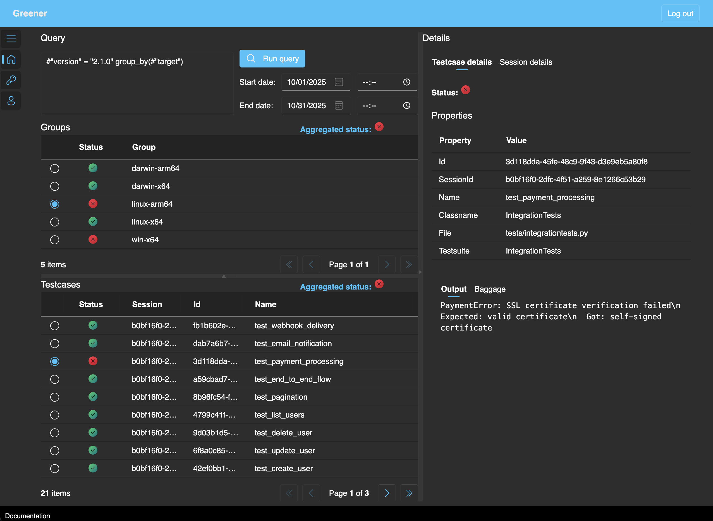

# Greener
Greener is a platform for storing and viewing test results.  
It is easy to configure and self-host, integrates with your favorite test framework (see [Plugins](plugins.md)) and supports a simple query language to let you access the data you need.

## Key Features
- **Simple configuration**  
  Self-host the platform as a single Docker container.  
  Install a plugin for your test framework, set 2 environment variables - and you are ready to go.

- **No lock-in**  
  No changes to the test code required.  
  Simply disable or uninstall the plugin to stop using Greener. 

- **SQL-like query language**  
  Write queries to match results with certain properties/labels.  
  Group results by one or more properties/labels.

- **Add metadata to sessions and results**
  Add labels and arbitrary JSON for advanced querying (e.g. release version, target platform, OTel trace context)

## Use Cases
- **Get to the failed tests and the error output fast**  
  Output from a test framework is usually a lot of text, which can be hard to navigate and keep track of.  
  Even when using JUnit XML output (which test frameworks normally support), it is still required to visualize the XML using some platform or tool.
- **View results of specific tests**  
  View tests that match specific properties/labels, for instance to investigate flaky test results over time or check the problematic test in the most recent pipeline.
- **Group test results and view aggregated group statuses**  
  You may need to quickly see test results per application version per operating system, for instance if the application versions 1, 2 and 3 have tests passing on Linux, macOS and Windows.
- **Connect test results to application logs**  
  Attach labels or baggage (arbitrary JSON data) to your test sessions or test cases, to associate them with application logs.
  For instance, attach OpenTelemetry trace ID to a test case, so that if the test failed you can quickly navigate to application logs using the trace ID.
- **Monitor long-running test pipelines in real-time**  
  Your testing process may be slow, and it can be beneficial to be able to view results before all the tests complete.
  For instance, you may want to cancel the test session early in case of test failures.

